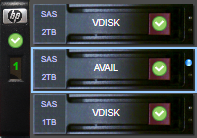
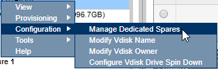
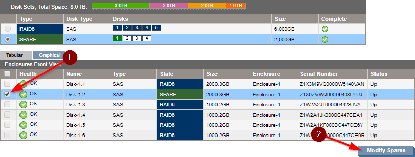
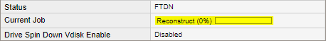

# How to replace/upgrade a drive in a HP MSA P2000

## Step 1 - Replace the disk

Remove the disk that needs replacing / upgrading and insert the new disk in your MSA. After a few seconds, the new drive should show up as available in the HP MSA Storage Management Utility:

## Step 2 - Re-Join the disk

In the Storage Management Utility, right-click the vdisk that contained the old disk and select Configuration > Manage Dedicated Spares:

The newly added drive should show as 'available'. Check the box next to it and click 'Modify Spares':

The disk will still show up as spare, but the RAID array will reconstruct and it will show up an active member of the array when it's done. This will take a long time:

