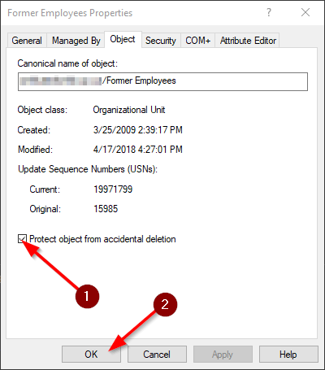

# How to unlock an Active Directory object

Sometimes you want to move or delete an Active Directory object such as an Organizational Unit, but you get an Access Denied error. This is because the object is locked for modification. Here's how to unlock it.

## 1 - Enable the Advanced view

Open Active Directory Users and Computers and select View / Advanced Features.

## 2 - Unlock the object

Open the properties window for the object that you want to unlock, click the Object tab and uncheck 'Protect object from accidental deletion':

You should now be able to move / delete / change the object. Just make sure to lock it again if it still exists to prevent accidental changes.